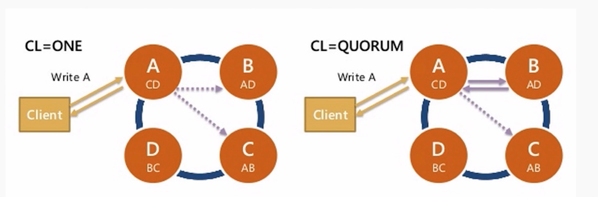
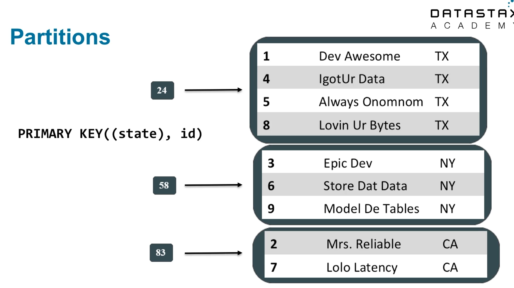
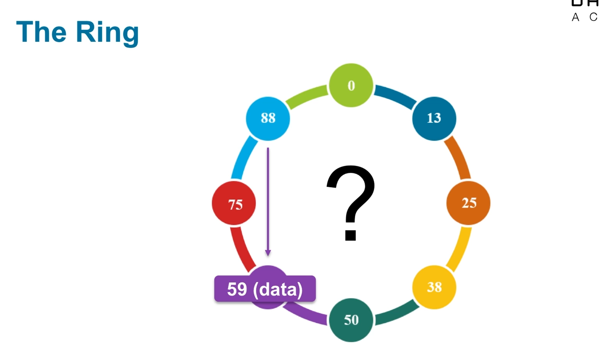

## Introduction

- Built for availability and linear scalability
- Fast distributed database
- peer to peer, no master, no fail over, no leader election
- Easy to deploy on commodity (cheap) hardware
- Not a drop in replacement for RDBMS
- partition key is what is used to insert into cassandra
    - partition key is run through hash function, and we can determine what node to talk to (where to read/write from)

### CAP Theorem

- During a network partition (computers can't talk to one another either between data centers or on a single network) you can choose consistency or you can get high availability
- Impossible to be both consistent and highly available during a network parition
- Latency between data centers also makes consistency pratical
    - Being consistency between data centers across countries just takes too long
    - asynchronously replicate data between data centers
- If you give up consistency, you can be highly available

### Replication (Replication Factor RF)

- RF=3 is common in prod
    - How many copies of each piece of data should be in cluster
- Keyspace is like a collection of tables
- Cassandra uses hinted handoffs to handle updating machines that were down (and they missed writes)

### Consistency Levels

- Per query consistency
- ALL, QUORUM, ONE
- How many replicates for query to respond OK

- Read/write speed will be impacted by consistency level
    - Lower consistency level will be faster, higher will be slower
    - Going to impact availability
        - Higher consistency means more nodes need to be online and available so you're going to be less available
- You get to choose what consistency level is appropriate for different parts of your application

### The Write Path

- Cassandra is really good at writing a lot of data quickly

## Partitions

- The partition key is how the data is placed on the ring (all the cassandra nodes)

- If you know that you want to group data by state, then you partition key should be state
- Partition key is always the first thing in your primary key
- Note in this example, that we also have id, state isn't unique enough to store all the data we need
    - Only having state would mean we could only store 50 rows
- Because you know exactly where your data is going to be, you can go to that exact spot in the ring and get that data (O(1) operation)

## Ring

- The ring = the cluster
- Each node is responsible for a range of data - this is known as `token range`

- Range of token values goes from (2^63(=)-1 to -2^63
- `Partitioner` determines where data gets written
    - By default md5 is used
- When a node joins the cluster, there is no down time
    - Existing nodes calculate where new node fits into the ring, other nodes stream data to new node
- Nodes exist in 4 states
    - up
    - down
    - joining
    - leaving