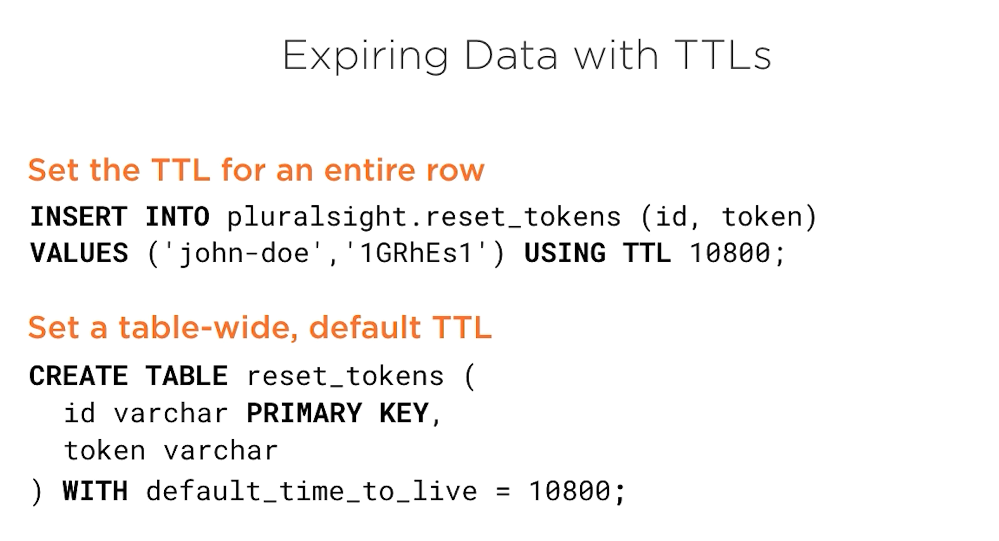

# https://app.pluralsight.com/library/courses/cassandra-developers

# What is Cassandra

## Introduction


- A Node is an actual instance of Cassandra
- It is a true masterless peer to peer system with no single point of failure
- Every node can do everything

<br>

- All data stored in Cassandra is associated with a token
    - The nodes split 


- Virtual nodes
    - Each node has vNodes
    - Each vNode takes on a smaller set of those possible token values
    


<br>

- How do we know where data will be stored?
- Cassandra is a partitioned row store  
    - Data is read or written with a partition key
    - When data is inserted, the partition key is hashed into a token
    - Token value determines what vNode and what physical node will be responsible for data
    
## Demo

Note:

```
    environment:
      - CASSANDRA_SEEDS=n1
```

- This is required to tell your Cassandra nodes what other nodes they can talk to in the cluster
- Turning on the n1 cassandra node in the single-dc example - `docker-compose up -d n1`

```
C:\workspace\cassandra\files-from-course\02\demos\demos\single-dc>docker-compose exec n1 nodetool status
Datacenter: datacenter1
=======================
Status=Up/Down
|/ State=Normal/Leaving/Joining/Moving
--  Address     Load       Tokens       Owns (effective)  Host ID                               Rack
UN  172.18.0.2  70.9 KiB   256          100.0%            728cc448-d1c9-4e60-b9f0-f35c1c91f374  rack1
```

- UN means the node is up and in a normal state
- Tokens 256 - really the number of vNodes presented by this node
- Tokens can mean 2 different thing
  - Sometimes can be a range of token values
  - Sometimes can be an individual token
  
<br>

```
C:\workspace\cassandra\files-from-course\02\demos\demos\single-dc>docker-compose exec n1 nodetool ring

Datacenter: datacenter1
==========
Address     Rack        Status State   Load            Owns                Token
                                                                           9219208317038028597
172.18.0.2  rack1       Up     Normal  70.9 KiB        100.00%             -9222942211072036392
.........
172.18.0.2  rack1       Up     Normal  70.9 KiB        100.00%             9219208317038028597

  Warning: "nodetool ring" is used to output all the tokens of a node.
  To view status related info of a node use "nodetool status" instead.
```
- These are all the virtual nodes
- Last column is the token value representing the end of the token range assigned to a vNode

<br>

- `docker-compose exec n1 more /etc/cassandra/cassandra.yaml`
  - Configuration for Cassandra node (where node is n1)
  - `num_tokens` - where number of vNodes (or token ranges) are set for this node

<br>

- If you add a new node to the cluster with `docker-compose up -d n2`, you can see with `docker-compose exec n1 nodetool status` that the status will be `UJ` - up and joining until n2 has joined cluster and it changes to `UN` (up and normal)
- With 2 nodes, our the token values will be randomly assigned to our 512 vNodes across 2 physical nodes

### Snitch

- What Cassandra to uses to route requests
  - Default is `SimpleSnitch`
  - `GossipingPropertyFileSnitch` - how nodes talk to one another, uses a property file that is deployed with each node
    - Nodes `gossip` this information to each other
    - Can be used to distinguish nodes in different racks or in different data centers
- `PropertyFileSnitch`
- Cloud providers have their own snitches
  - Like `EC2Snitch`
  
## Replication and Consistency

### Replication Strategies

- Multiple copies of data stored on nodes throughout cluster
- Increased availability and resiliency

#### Cassandra Terminology

- keyspace
  - data in Cassandra is organized into key spaces
  - like a table space in the MySQL
  - keyspaces have tables
  
- table
  - Close to relational counter part
  
- partition
  - all data written to cassandra is associated with a partition key
  - partition key determines where data is stored in the cluster
    - all data with same partition key is stored together
  
- Row
  - Data within a partition is represented this way
  
- Replication Strategy
  - Determined at keyspace level
  - keyspace settings used to determine number of copies of data and where they are stored throughout cluster
  - SimpleStrategy
    - Best used in dev environment or single datacenter cluster
    - Data is replicated on the next nodes clockwise in the ring w/o considering topology rack or data center)
  - NetworkTopologyStrategy
    - Can say how much data you want and different data centers (for example)
    - Used for production environments
  


### Tunable Consistency

- Reads and Writes in Cassandra
- When a client connects to a cluster, the node it connects to is called the `coordinator node`
  - This node will facilitate communication between client and cluster
  - Coordinator node will receive insert statement and determine which node(s) in the cluster should process the writes
  - Will then communicate that write to the `replica nodes`
  - A coordinator node can also be one of the nodes that is responsible for storing the data


<br>

- Tunable Consistency Writes
- Nodes can become unresponsible for any reason
- When you are writing to multiple nodes, you can decide how may acks you need from the nodes being written before returning a success/fail to the client


- ONE here means we only need one ack before returning success to the client, TWO would be two acks, etc
- QUORUM is a special one where majority of replica nodes have sent acks back to coordinator node
- ALL means that all nodes sent ack back
- ANY means if write makes it into cluster at all (even just to coordinator node) we send success back to client
- Cassandra lets you do this tuning with each statement
  
<br>

- Hinted Handoff
  - What happen if a write fails?
    - If you use a `QUROUM` for example, a write could fail but still look like a success - this is what the `hinted handoff` is for
- Data is written on coordinator node, and then the coordinator node continually tries to write to whatever replica nodes were unresponsive
  - Once successful, the data will be removed from the coordinator node
- What happens if the coordinator node goes down?
  - Cassandra has a strategy for thsi

<br>

- Tunable Consistency - Reads
- How many nodes the coordinator will consult in order to return the most up to date data to the client
  - Retrieves data from one node and a `digest` of the data from additional nodes

- Tunable consistency for reads allows the client to say how important it is that they get the most up to date data
  - ONE means data from one node is sufficent
  - TWO from two nodes (1 digest node)
  - THREE from three nodes (2 digest node)
  - QUORUM from majority of nodes will be consulted
  - ALL from all nodes
- What happens if replicas don't agree?
  - If you have a consistency level of ALL, each node would be consulted, and coordinator node would read full data from all 3 nodes, determine correct data and write it back to the node that is in error, now all nodes are consistent
    - NOTE: This is called **read repair**
  - For other consistency levels, a read repair is done on an ongoing basis
- `nodetool repair` will fix inconsistencies between nodes w/o waiting for the data to be read

<br>

- Achieving Strong Consistency
- Cassandra can be eventual consistency, but strong consistency is possible
- If `(write consistency + read consistency) > replication factor`, you have strong consistency
  - If you are:
    - writing with consistency of 1
    - reading with a quorum
    - have a replication factor of 3
      - you will have eventual consistency
        - This is because for any given read, the quorum of nodes you consult could be the 2 nodes that have not yet been written to so you could get old data
  - If you are:
    - writing with consistency of 1
    - reading with a consistency of ALL
    - have a replication factor of 3
      - you will have strong consistency
        - This is because your node you wrote to is guaranteed to be read from
          - The read repair here will also happen on the 2 nodes that didn't get the write that happened
  - If you are:
    - writing with consistency of 1
    - reading with consistency of 1
    - have a replication factor of 3
      - you will have eventual consistency
        - could read from a node that has old data
  - If you are:
    - writing with consistency of QUROUM
    - reading with consistency of QUROUM
    - have a replication factor of 3
      - you will have strong consistency
        - **note this is common and is a good way to achieve strong consistency**
  
<br>

- Consistency with multiple Data Centers
- 3 additional consistency levels
  - EACH_QUORUM
    - quorum of writes happens in each data center
  - LOCAL_QUORUM
    - once quorum has been reached in data center where node coordinator is
  - LOCAL_ONE
    - same as consistency level of 1
    - read happens from node where node coordinator is located

## Introduction to CQL

### Introducing CQL and cqlsh

- CQL = cassandra query language


- You can have more than 1 column used to define a key
  - `PRIMARY KEY ((id, author))`

### Demo 

```
cqlsh> create keyspace pluralsight with replicatio = {'class':'SimpleStrategy', 'replication_factor': 1};
SyntaxException: Unknown property 'replicatio'
cqlsh> create keyspace pluralsight with replication = {'class':'SimpleStrategy', 'replication_factor': 1};
cqlsh> use pluralsight;
cqlsh:pluralsight> create table courses (id varchar primary key);
cqlsh:pluralsight> create table courses (id varchar primary key);
AlreadyExists: Table 'pluralsight.courses' already exists
cqlsh:pluralsight> create table if not exists courses (id varchar primary key);
cqlsh:pluralsight> alter table courses add duration int;
cqlsh:pluralsight> alter table add released timestamp;
SyntaxException: line 1:12 no viable alternative at input 'add' (alter table [add]...)
cqlsh:pluralsight> alter table courses add released timestamp;
cqlsh:pluralsight> alter table courses add author varchar;
cqlsh:pluralsight> alter table courses with comment = 'A table of courses';
cqlsh:pluralsight> desc table courses;

CREATE TABLE pluralsight.courses (
    id text PRIMARY KEY,
    author text,
    duration int,
    released timestamp
) WITH bloom_filter_fp_chance = 0.01
    AND caching = {'keys': 'ALL', 'rows_per_partition': 'NONE'}
    AND comment = 'A table of courses'
    AND compaction = {'class': 'org.apache.cassandra.db.compaction.SizeTieredCompactionStrategy', 'max_threshold': '32', 'min_threshold': '4'}
    AND compression = {'chunk_length_in_kb': '64', 'class': 'org.apache.cassandra.io.compress.LZ4Compressor'}
    AND crc_check_chance = 1.0
    AND dclocal_read_repair_chance = 0.1
    AND default_time_to_live = 0
    AND gc_grace_seconds = 864000
    AND max_index_interval = 2048
    AND memtable_flush_period_in_ms = 0
    AND min_index_interval = 128
    AND read_repair_chance = 0.0
    AND speculative_retry = '99PERCENTILE';

cqlsh:pluralsight> drop table courses;
```

```
cqlsh:pluralsight> create table courses (
               ... id varchar primary key,
               ... name varchar,
               ... author varchar,
               ... audience int,
               ... duriation int,
               ... cc boolean,
               ... released timestamp
               ... ) with comment = 'A table of courses';
```

### Selecting, Inserting, Updating

- **Important to note with Cassandra queries is you need to be mindful of how many nodes the coordinator node will reach out to in order to fulfill your query's request**
- `SELECT id, title FROM pluralsight.courses`
  - Queries like this should be ran with care because coordinator node will have to reach out to every other node in the cluster that is holding any courses data


- In Cassandra, inserts, updates, and deletes are the same thing - they are **upserts**




<br>

- When you delete data from cassandra, a `tombstone` is written to the database - marking data in question as deleted


- Say here that the 3rd node doesn't get the request to delete some data, the read repair process will propagate the tombstone to the outdated node


- Tombstones are periodically purged from database
  - It's important not to purge too frequently
  - Time to purge is called `gc_grace_seconds`
    - Number of seconds to wait between garbage collections
  - If only 2 nodes get tombstone, then you purge, the 3rd node will still have that outdated data
  - When the read repair happens, that "outdated" node will look like the only updated one and that stale data will be replicated back to the other 2 nodes

### Demo

- Piping data from cql in file into cassandra db
  - `C:\workspace\cassandra\files-from-course\04\demos\demos>cat scripts\m3\courses.cql | docker-compose exec -T n1 cqlsh`


```
C:\workspace\cassandra\files-from-course\04\demos\demos>docker-compose exec n1 cqlsh
Connected to Test Cluster at 127.0.0.1:9042.
[cqlsh 5.0.1 | Cassandra 3.11.11 | CQL spec 3.4.4 | Native protocol v4]
Use HELP for help.
cqlsh> use pluralsight;
cqlsh:pluralsight> desc tables;

courses

cqlsh:pluralsight> select * from courses;

 id                          | audience | author            | cc   | duration | name                        | released
-----------------------------+----------+-------------------+------+----------+-----------------------------+---------------------------------
             advanced-python |        3 | Robert Smallshire | True |    13980 |             Advanced Python | 2017-06-24 00:00:00.000000+0000
         advanced-javascript |        2 |      Kyle Simpson | True |    24900 |         Advanced Javascript | 2015-04-09 00:00:00.000000+0000
          nodejs-big-picture |        1 |     Paul O'Fallon | True |     3240 |    Node.js: The Big Picture | 2019-06-03 00:00:00.000000+0000
 raspberry-pi-for-developers |        2 |      Jon Flanders | True |     8640 | Raspberry Pi for Developers | 2013-05-30 00:00:00.000000+0000
           react-big-picture |        1 |        Cory House | True |     4260 |      React: The Big Picture | 2017-11-21 00:00:00.000000+0000
```

- By default, the id (the partition key) must be apart of the where clause or you must not have a where clause at all

```
cqlsh:pluralsight> select * from courses where author='Cory House';
InvalidRequest: Error from server: code=2200 [Invalid query] message="Cannot execute this query as it might involve data filtering and thus may have unpredictable performance
. If you want to execute this query despite the performance unpredictability, use ALLOW FILTERING"
```

- Adding users table

```
cqlsh:pluralsight> update users set first_name='Jane', last_name='Doe' where id='jane-doe';
cqlsh:pluralsight> insert into users (id, first_name, last_name, email) values ('john-doe', 'John', 'Doe', 'john@doe.com');
cqlsh:pluralsight> select * from users;

 id       | email        | first_name | last_name | password | reset_token
----------+--------------+------------+-----------+----------+-------------
 jane-doe |         null |       Jane |       Doe |     null |        null
 john-doe | john@doe.com |       John |       Doe |     null |        null
```

- Setting a value in a row and setting TTL on that value

```
cqlsh:pluralsight> update users using ttl 120 set reset_token='abc123' where id='john-doe';
cqlsh:pluralsight> select * from users;

 id       | email        | first_name | last_name | password | reset_token
----------+--------------+------------+-----------+----------+-------------
 jane-doe |         null |       Jane |       Doe |     null |        null
 john-doe | john@doe.com |       John |       Doe |     null |      abc123

cqlsh:pluralsight> select ttl(reset_token) from users where id='john-doe';

 ttl(reset_token)
------------------
               64

(1 rows)
```

## Multi-row Partitions


- Each partiton only contains 1 row of data

```
PRIMARY KEY (partition_key)
PRIMARY KEY (partition_key, clustering_key)
```

- partition_key + clustering_key = composite key
- **With this, we are no longer constrained to one row per partition**
- A table with a composite key can have multiple rows in a single partition

<br>

- You can have multiple clustering keys and parition keys

```
PRIMARY KEY (p_key, c_key1, c_key2, ... c_keyN)
PRIMARY KEY ((p_key1, p_key2, ... p_keyN) c_key1, ... c_keyN)
PRIMARY KEY ((p_key1, p_key2, ... p_keyN))
```

<br>

- Having this setup allows us to group data together (similar to how joins would work with a relational database)


